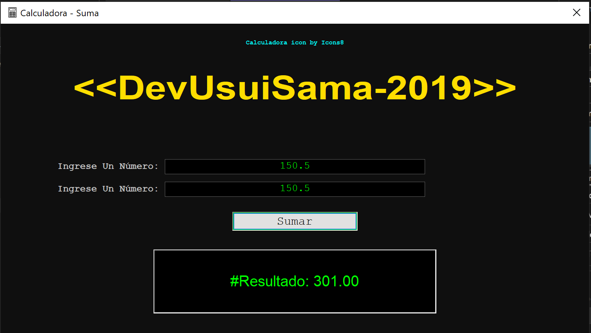

# Calculadora Suma

## Descripción

Este proyecto fue desarrollador durante la carrera de Téc. En Programación y Análisis de Sistemas.
Este proyecto tiene como finalidad replicar el comportamiento de la coma en los decimales (en este caso visto como un punto) de las calculadoras. 

## Previsualización

## Arquitectura

La arquitectura elegida para debugear y hacer el release fue **x64**.

## Compilar

Para compilar este proyecto, es necesario tener la disponibilidad de **Visual Studio 2019 - 2022**, y tener instalado los **paquetes de MFC**.

## Construido con 🛠️

* MFC - C++

## Autor ✒️
* **Usui, José Fernando** - *Diseño y Desarrollo de la Desktop App*

## Contacto 📱
* Gmail: _joesesilvae@gmail.com_